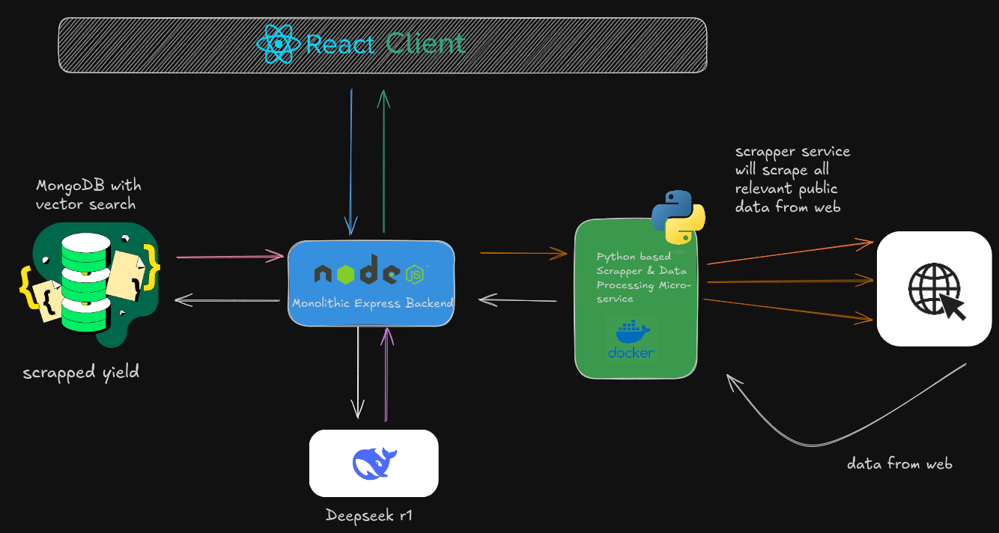

# AlphaFinance

## Overview
AlphaFinance is a financial data aggregation and processing platform that scrapes, processes, and analyzes publicly available financial data. The system is built with a microservices architecture using Python, Node.js, and React, ensuring scalability, efficiency, and modularity.

## System Architecture

The system consists of the following key components:

### 1. **Frontend (React Client)**
   - Built with **React.js** for a seamless user experience.
   - Communicates with the backend via REST APIs.
   - Displays real-time processed financial data.

### 2. **Backend (Monolithic Express.js Server)**
   - Built with **Node.js** and **Express.js**.
   - Manages API requests and routes data between the frontend, database, and microservices.
   - Communicates with the database to store and retrieve data.

### 3. **Scraper & Data Processing Microservice**
   - Implemented in **Python** using **Scrapy** and **BeautifulSoup**.
   - Scrapes relevant financial data from public websites.
   - Processes and structures data before sending it to the backend.
   - Runs inside a **Docker container** for isolation and scalability.

### 4. **Database (MongoDB with Vector Search)**
   - Stores scraped and processed financial data.
   - Uses **vector search** for efficient querying.

### 5. **LLM Integration (Deepset r1)**
   - Utilizes a Large Language Model (LLM) for advanced data analysis.
   - Enhances search and retrieval capabilities with natural language queries.

## Folder Structure
```
AlphaFinance/
│── frontend/                  # React Client
│   ├── src/
│   ├── public/
│   ├── package.json
│   └── ...
│
│── backend/                   # Express.js Backend
│   ├── routes/
│   ├── controllers/
│   ├── models/
│   ├── server.js
│   ├── package.json
│   └── ...
│
│── scraper/                   # Scraper & Data Processing Microservice
│   ├── spiders/
│   ├── processors/
│   ├── requirements.txt
│   ├── Dockerfile
│   └── ...
│
│── database/                   # MongoDB Configuration
│   ├── config/
│   ├── scripts/
│   └── ...
│
│── llm/                        # LLM Integration (Deepset r1)
│   ├── models/
│   ├── api/
│   ├── config/
│   └── ...
│
│── docker-compose.yml           # Docker Compose Setup
│── README.md                    # Project Documentation
│── .env                          # Environment Variables
```

## Installation & Setup
### 1. Clone the Repository
```bash
git clone https://github.com/your-repo/AlphaFinance.git
cd AlphaFinance
```

### 2. Setup & Run Docker Containers
Ensure **Docker** is installed and running:
```bash
docker-compose up --build
```

### 3. Running Services Manually
Alternatively, you can run services manually:
#### Start Backend
```bash
cd backend
npm install
npm start
```
#### Start Scraper
```bash
cd scraper
pip install -r requirements.txt
python scraper.py
```
#### Start Frontend
```bash
cd frontend
npm install
npm start
```

## Technologies Used
- **Frontend:** React.js
- **Backend:** Node.js, Express.js
- **Scraper:** Python (Scrapy, BeautifulSoup)
- **Database:** MongoDB (Vector Search)
- **LLM:** Deepset r1
- **Containerization:** Docker

## Contributors
- **Anshuman p** - [GitHub](https://github.com/anshumancodes)
- **Subhransu** - [GitHub](https://github.com/subhr4nshu)
- **Ayush d** - [GitHub](https://github.com/ayushduttatreya)


## License
This project is licensed under the MIT License.

---
**AlphaFinance** - Transforming financial data with AI-powered insights.

